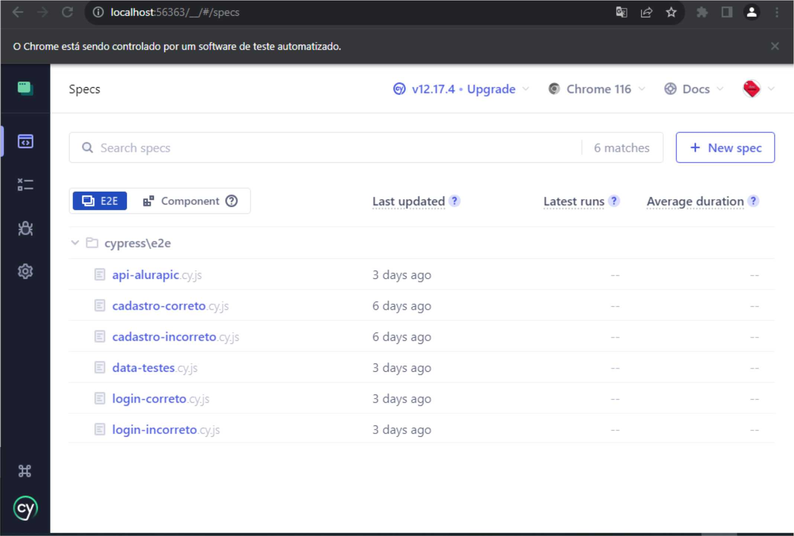

# Projeto Automação com Cypress Alura PIC

Esse é um projeto que fiz em meu curso de Cypress na [Alura](https://www.alura.com.br/).
Neste projeto fiz os testes E2E no site da Alura PIC, criado exclusivamente para
fins didáticos.

## 📍Índice

- <a href="#testes">Principais Testes</a>
- <a href="#tecnologias">Tecnologias Utilizadas</a>
- <a href="#rodar">Como rodar este projeto?</a>

## ⚡Principais Testes

- [Teste de Cadastro de novo usuário](.//cypress/e2e/cadastro-correto.cy.js)
- [Teste de Cadastro Incorreto](./cypress/e2e/cadastro-incorreto.cy.js)
- [Teste de Login Correto](./cypress/e2e/login-correto.cy.js)
- [Teste de Login Incorreto](./cypress/e2e/login-incorreto.cy.js)
- [Teste de API](./cypress/e2e/api-alurapic.cy.js)

## 💻Tecnologias Utilizadas

- IDE (eu utilizo o VSCode)
- NodeJS (neste projeto utilizei a v18.13.0)
- Cypress (neste projeto utilizei v12.17.4)

## ❓Como rodar esse projeto?

Para começarmos, é importante que você tenha essas ferramentas instaladas na sua máquina. Caso não tenha, use os links abaixo para fazer o download:

👉 Instalando o [Node.js](https://nodejs.org/pt-br/download):

1 - Abra uma janela do terminal em seu computador. Isso pode ser feito da seguinte forma:

Windows: você pode acessar a busca no menu Iniciar e procurar por “prompt de comando”, ou acessar via Menu Iniciar > Sistema do Windows > Prompt de Comando.

MacOs: O Terminal está disponível no menu de Aplicações, dentro da pasta de Utilitários.

Linux (Ubuntu): O Terminal está disponível no menu de Programas/Aplicações. Caso não localize, pode estar dentro da pasta Utilitários.

2 - No terminal, digite:
```
node --version ou node -v -
```
 Caso retorne um número de versão, por exemplo, v18.13.0, o Node.js já está instalado.

Caso não esteja instalado, você pode seguir o passo a passo do artigo [“Como instalar o Node.js no Windows, Linux e macOS”!](https://www.alura.com.br/artigos/como-instalar-node-js-windows-linux-macos?_gl=1*n0n8fd*_ga*MzIwMDc4NDMuMTY2MjQ1NjgxMQ..*_ga_1EPWSW3PCS*MTY5Mzc2NTAzNi40NC4xLjE2OTM3Njc0MDAuMC4wLjA.*_fplc*WWdhOTdvU1YlMkJqdG9xc1NsN0pTNE9GUEM1ZGtCMURhNDNHTmZmU25QQ09qamczUnQ4S3h2JTJGVTNsaUIzcUtSb0lsRkJSSndVZUhpQU9aYnJ4ZHJ0N3F0TlRCTVZTRFc4RUlEYVhOZ3NwOGZTbFdBY1NyUHVXc3VTbkczcUVPUSUzRCUzRA..*_ga_59FP0KYKSM*MTY5Mzc2NTAzNi4xNTUuMS4xNjkzNzY3NDAwLjAuMC4w)

👉 Instalando o [VScode](https://code.visualstudio.com/download)

Os links para baixar e instalar de acordo com o seu sistema operacional estão na [página inicial do VSC.](https://code.visualstudio.com/download)
Para Instalar o VSCode basta clicar no botão download e seguir os passos indicados.

👉 Instalando o [Cypress](https://www.cypress.io/):

Para instalar exatamente a mesma versão do Cypress que utilizamos durante o projeto, vamos abrir o terminal integrado do VS Code, pressionando "Ctrl + J". Em seguida, vamos executar o seguinte comando:
```
npm install cypress@12.17.4 --save-dev
```
Finalizada a instalação, precisamos subir a interface de usuário do próprio Cypress para explorarmos como ele funciona. Para isso, vamos executar o seguinte comando:
```
npx cypress open
```
A janela da interface de usuário do Cypress será aberta.
Feito isso, clicamos em "E2E (end-to-end) testing", em seguida escolhemos navegador e clicamos em  "Start E2E Testing in Chrome"(caso o navegador escolhido seja o Chrome).

O navegador será executado em uma nova aba em um ambiente de testes automatizado conforme a imagem abaixo 👇



Pronto! Basta escolher qual teste você quer ver rodando.

---
Disponibilizado por [Josi Floriani](https://www.linkedin.com/in/josiflorianiqa/)
